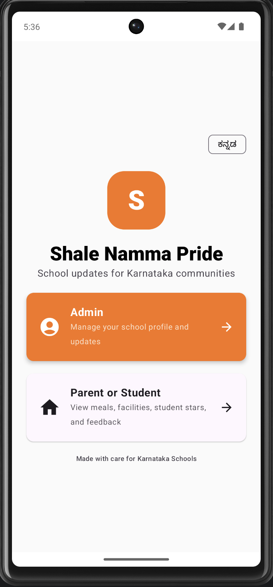

# Shale Namma Pride Android App

This folder contains the native Android app built with Kotlin and Jetpack Compose.

---

# Core Features
- Admin and Parent/Student role flow
- School selection from Firebase Firestore
- Daily meal updates
- Facilities gallery
- Student star profiles
- Feedback submission and admin feedback management
- Bilingual UI support in English and Kannada
- AI-assisted translation for admin data entry and feedback display

---

# App Screenshots

## Homepage

<p align="center">
  
</p>

---

# Admin Login Features

## Admin Login

<p align="center">
  
</p>

## Feedback Sentiment Analysis

<p align="center">
  
</p>

## Meal Nutrition Analysis

<p align="center">
  
</p>

---

# User Login Features

## Daily Meal

<p align="center">
  
</p>

## Facility Tour

<p align="center">
  
</p>

## Feedback

<p align="center">
  
</p>

## School Selection

<p align="center">
  
</p>

## Student Stars

<p align="center">
  
</p>

---

# AI Features

The admin portal includes two AI-assisted analysis tools.

## 0. Translation Support
- Parent/student feedback entered in English can be shown in Kannada when the app language is switched to Kannada
- Admin feedback lists also show translated feedback content in Kannada mode
- In admin forms, users can type the English version and use a translate action to fill Kannada fields
- Translation support is available for:
  - School name and location
  - Meal menu
  - Facility name and description
  - Student name
  - Student title
  - Student achievement
- The same translate option is available in edit dialogs for facilities and student stars
- Admin status and upload/update messages are localized in Kannada when Kannada mode is selected

## 1. Meal Nutrition Analysis
- Available only for admin users
- Triggered from the admin Meal section
- Analyzes the daily meal menu and shows:
  - Nutrition summary
  - Calories
  - Protein
  - Iron
  - Balanced diet score
  - Suggestions
- Displays graphs in the UI
- Exports a downloadable PDF report

## 2. Feedback Sentiment Analysis
- Available only for admin users
- Triggered from the admin Feedback section
- Analyzes parent/student feedback and shows:
  - Sentiment
  - Category
  - Priority
  - One-line summary
  - Positive / Neutral / Negative trend graphs
  - Frequent issue graphs
- Exports a downloadable PDF report

---

# AI Setup

This app currently supports three analysis paths:

1. `geminiBackendUrl` set:
   The Android app calls your own backend.

2. `geminiBackendUrl` blank and `geminiApiKey` set:
   The Android app calls Gemini Developer API directly.
   This is the current free-tier testing path.

3. If both fail:
   The app falls back to a local rule-based analyzer so the feature still works.

## Free-tier Gemini Setup

Add this to `android/local.properties`:

```properties
geminiApiKey=PASTE_YOUR_GOOGLE_AI_STUDIO_API_KEY_HERE
geminiBackendUrl=
```

### Notes
- `local.properties` is intentionally ignored by Git.
- Rebuild the app after changing the key.
- Direct client-side API keys are okay for testing/demo use, but not ideal for a public production app.

---

# Firebase Setup

1. Open this `android/` folder in Android Studio.
2. Add your Firebase Android app with package name:
   `com.example.shale`
3. Place `google-services.json` in:
   `android/app/google-services.json`
4. Make sure Firestore, Auth, and Storage are enabled in Firebase.

This app uses the named Firestore database already configured in the codebase:
- `ai-studio-63469dff-58db-465d-aead-0d809c39f872`

---

# Build and Run

## From Android Studio
- Open the `android/` folder
- Sync Gradle
- Run on emulator or device

## From Terminal

```bash
cd android
./gradlew :app:assembleDebug
```

---

# Important Files

- `app/src/main/java/...` : Kotlin source
- `app/src/main/res/...` : Android resources
- `app/src/main/AndroidManifest.xml` : Manifest
- `app/build.gradle` : App module Gradle config
- `build.gradle` : Project Gradle config
- `settings.gradle` : Gradle settings
- `gradle/wrapper/...` : Gradle wrapper files

---

# Do Not Commit

These files should stay local:
- `local.properties`
- Build outputs
- APK/AAB files
- Signing keys
